[Read this README in English](README.md)

# Open Accountant

> Contabilidad personal de partida doble que corre en forma local, responde rápido y permanece bajo tu control.

[](https://python.org)
[](https://fastapi.tiangolo.com)
[](https://github.com/marzzelo/open-accountant/releases/latest)
[](LICENSE)

Open Accountant es una aplicación de contabilidad personal basada en navegador, construida con FastAPI, SQLite, JavaScript vanilla, Tailwind CSS y Chart.js. Está pensada para autoalojarse en tu propia máquina o red local, con los datos guardados localmente en libros SQLite y sin depender de servicios en la nube.

El proyecto fue desarrollado en gran parte con ayuda de IA, especialmente mediante el sistema de agentes OpenClaw. Los contribuyentes también pueden usar ese flujo, siempre que cada cambio se revise con cuidado y se explique con claridad.

---

## Características

| Área | Detalles |
| --- | --- |
| Contabilidad de partida doble | Cada transacción debita una cuenta y acredita otra, por lo que los libros quedan balanceados por construcción |
| Gestión multi-libro | Crea, activa, renombra, respalda, importa y elimina libros independientes guardados como archivos SQLite separados |
| Tablero Kanban | Vista visual para activos, pasivos, patrimonio, ingresos y gastos con flujos de transferencia por arrastre y pulsación prolongada |
| Carga inteligente de transacciones | Los formularios aceptan expresiones en el importe, precarga de origen y destino, atajos reutilizables, flujos fijados y modo de saldo objetivo |
| Registro con monedas | Permite cargar movimientos en ARS o USD usando cotización oficial compra, oficial venta, blue compra, blue venta o tarjeta |
| Trazabilidad cambiaria | Las transacciones guardan monto contabilizado, monto original, moneda original, tasa FX y fuente de cotización para auditoría posterior |
| Clasificación financiera | Las cuentas pueden clasificarse por liquidez, plazo del pasivo y gasto esencial o discrecional desde el formulario de cuentas |
| Lógica de liquidez robusta | Ratio corriente, prueba ácida, runway y salud de proyecciones siguen funcionando aunque se renombren o eliminen subtipos, porque el backend normaliza e infiere propiedades |
| Reportes | Balance General, Libro Diario, Libro Mayor y vista de Transacciones con drill-down, ordenamiento y exportación CSV y PDF |
| Filtros de reportes | El Balance puede ocultar cuentas, mostrar u ocultar secciones en cero y filtrar por tipo contable |
| Panel estadístico | Tarjetas KPI, análisis de flujo mensual, desgloses de ingresos y gastos, composición de activos, concentración por cuentas y evolución patrimonial |
| Proyecciones | Proyecciones por regresión para ingresos, gastos, ahorro, activos y pasivos, más series programadas definidas por el usuario |
| Resumen de salud proyectada | Tarjetas con estado actual, final base, final con escenario y delta final para patrimonio, ratios de liquidez y runway |
| Configuración y preferencias | Cambio de idioma en tiempo real, gestión de cotizaciones, fetch automático desde Bluelytics, preferencias por libro, edición enmascarada de `.env` y sonidos FX opcionales |
| UI responsive | Barra de herramientas de escritorio, menú móvil, FAB, modales tipo bottom-sheet y layouts adaptativos |
| Offline y privado | Los datos viven localmente en archivos SQLite dentro de `data/` y pueden usarse sin servicios externos |
| Verificación de integridad | El panel About usa metadatos sellados con HMAC y muestra una alerta si falla la verificación |

### Vista previa de la interfaz

<p align="center">
  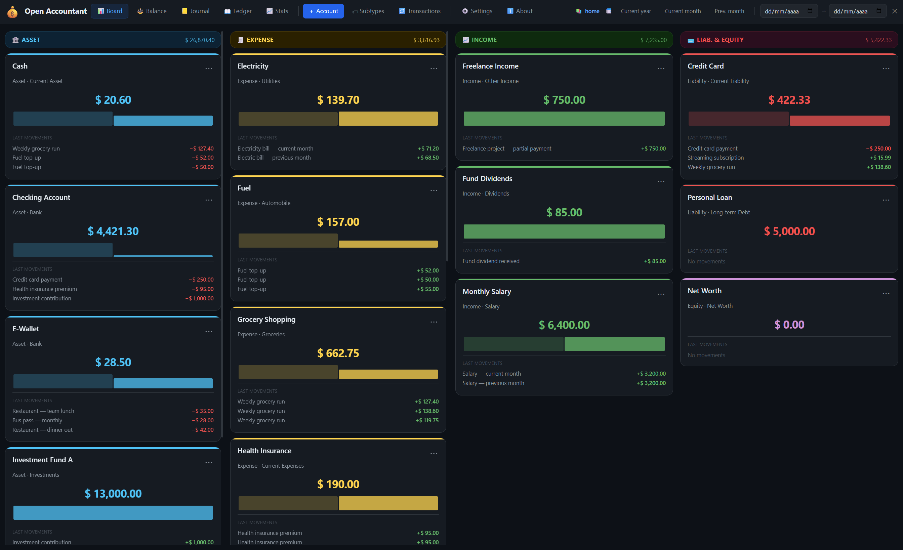
</p>
<p align="center"><em>Tablero principal con cuentas agrupadas por clase contable para una navegación rápida.</em></p>

<p align="center">
  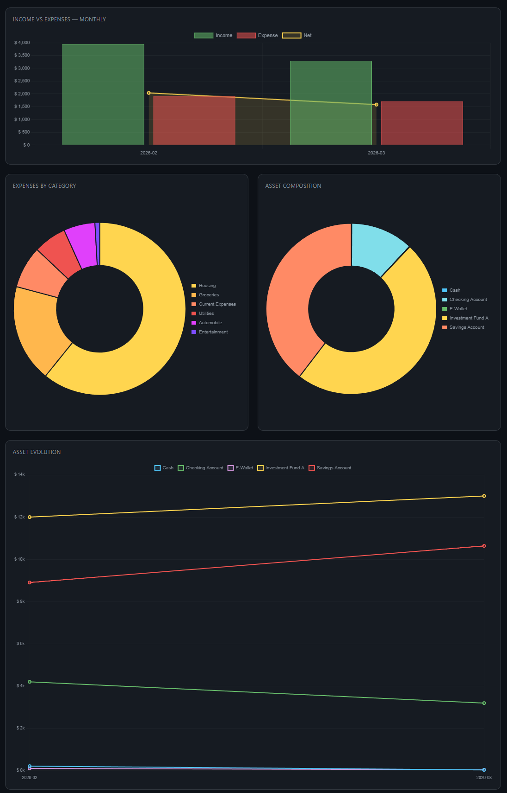
</p>
<p align="center"><em>Dashboard estadístico con KPI, tendencias de flujo y gráficos de salud financiera.</em></p>

---

## Requisitos

- Python 3.10+
- pip
- Un navegador moderno como Chrome, Firefox, Safari o Edge

---

## Instalación

### Linux / macOS

```bash
git clone https://github.com/marzzelo/open-accountant.git
cd open-accountant
bash install.sh
```

Flags opcionales:

```bash
bash install.sh --host 0.0.0.0 --port 5001
bash install.sh --force-db
```

### Windows

```bat
git clone https://github.com/marzzelo/open-accountant.git
cd open-accountant
install.bat
```

### Instalación manual

```bash
python -m venv .venv
.venv/bin/python -m pip install -r requirements.txt
.venv/bin/python scripts/seed_demo.py
.venv/bin/python main.py
```

Luego abre http://127.0.0.1:5001/ en tu navegador.

### Docker

```bash
docker build -t open-accountant:local .
docker run --rm -p 5001:5001 -v open-accountant-data:/app/data open-accountant:local
```

Las imágenes también pueden distribuirse vía GHCR como:

`ghcr.io/marzzelo/open-accountant`

---

## Ejecución

```bash
bash start.sh
.venv/bin/python main.py
.venv\Scripts\python main.py
```

El servidor de desarrollo se inicia con recarga en caliente para el código Python.

## Testing

```bash
pip install -r requirements.txt -r requirements-dev.txt
pytest
```

El repositorio incluye tests unitarios, smoke tests de API y un workflow de GitHub Actions que los ejecuta en pushes y pull requests.

---

## Uso

### Primera ejecución

Después de instalar, se crea un libro demo llamado Home con cuentas sembradas y transacciones anonimizadas para que puedas explorar la interfaz de inmediato.

### Gestión de libros

- Crea nuevos libros desde Settings -> Books
- Opcionalmente inicia un libro nuevo con cuentas básicas
- Activa otro libro actual sin reiniciar la interfaz del navegador
- Renombra libros desde el panel de configuración
- Descarga backups SQL por libro
- Importa un volcado SQL en un libro nuevo
- Mantiene transacciones, cuentas y preferencias de usuario aisladas por libro

### Cuentas y clasificación financiera

Las cuentas soportan la estructura habitual de tipo, subtipo, descripción y saldo inicial, más un payload normalizado de propiedades usado por analítica y proyecciones.

- Las cuentas de activo pueden marcarse como liquidez inmediata, corriente o no corriente
- Las cuentas de pasivo pueden marcarse como corriente o de largo plazo
- Las cuentas de gasto pueden marcarse como esenciales o discrecionales
- Si dejas esos selectores en automático, el backend infiere una clasificación razonable a partir del nombre de la cuenta y del subtipo
- Los ratios y el runway siguen funcionando aunque el usuario renombre o elimine etiquetas de subtipos, porque la clasificación se guarda a nivel cuenta y se normaliza del lado servidor

<p align="center">
  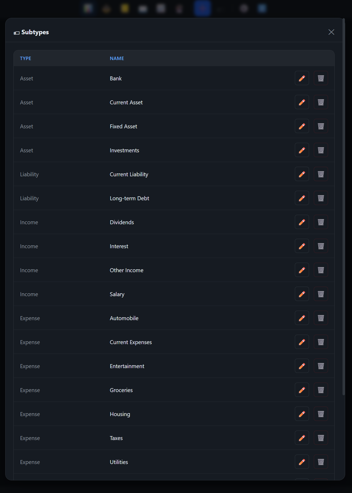
</p>
<p align="center"><em>La gestión de subtipos ayuda a mantener ordenado el plan de cuentas y brinda etiquetas estables para reportes y métricas de liquidez.</em></p>

### Carga de transacciones

- Crea transacciones desde el tablero, la barra superior o las tarjetas de cuenta
- Elige ARS o alguno de los modos USD soportados: compra, venta, blue compra, blue venta o tarjeta
- Sobrescribe manualmente la tasa de cambio antes de guardar si lo necesitas
- Conserva el monto original en moneda extranjera junto al monto contabilizado en ARS
- Guarda la fuente FX usada para que los reportes muestren de dónde salió la cotización
- Usa el modo de saldo forzado para registrar una transacción cuyo objetivo sea llevar la cuenta debitada o acreditada a un saldo determinado
- Ingresa expresiones aritméticas simples en el campo de importe cuando te resulte más práctico que calcular afuera

<p align="center">
  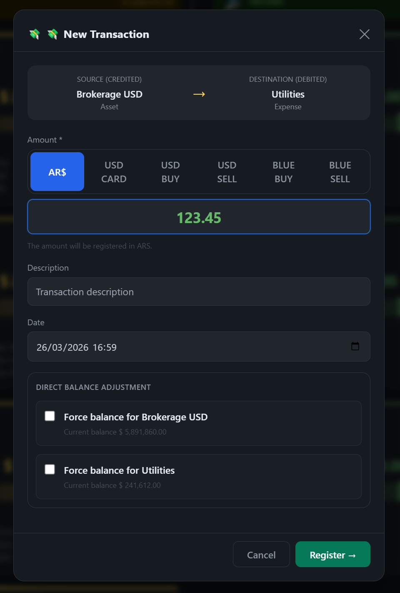
</p>
<p align="center"><em>El diálogo de transacciones permite elegir modo de moneda, ajustar la fecha, escribir descripciones libres y usar el modo de saldo objetivo.</em></p>

### Flujos del tablero y atajos

- Haz pulsación prolongada sobre una tarjeta en mobile para marcarla como cuenta origen de crédito y luego toca otra tarjeta para abrir una transferencia precargada
- Arrastra una tarjeta sobre otra en desktop para abrir el mismo flujo de transferencia
- Cancela una selección de origen tocando nuevamente la tarjeta ya seleccionada
- Reutiliza patrones recientes desde el panel Common transactions
- Fija los flujos más usados para mantenerlos arriba

<p align="center">
  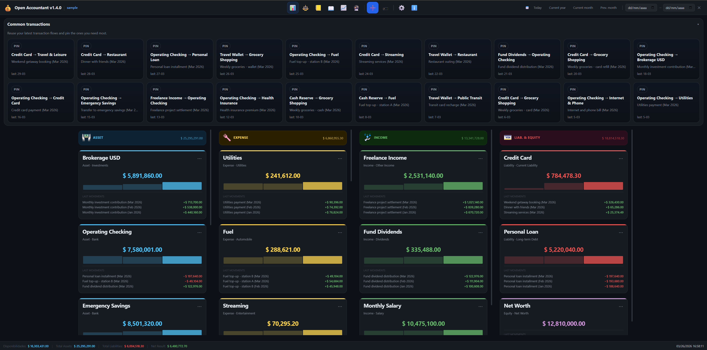
</p>
<p align="center"><em>El tablero combina transacciones frecuentes reutilizables con tarjetas de cuentas en vivo para lanzar movimientos rutinarios con mínima carga.</em></p>

<p align="center">
  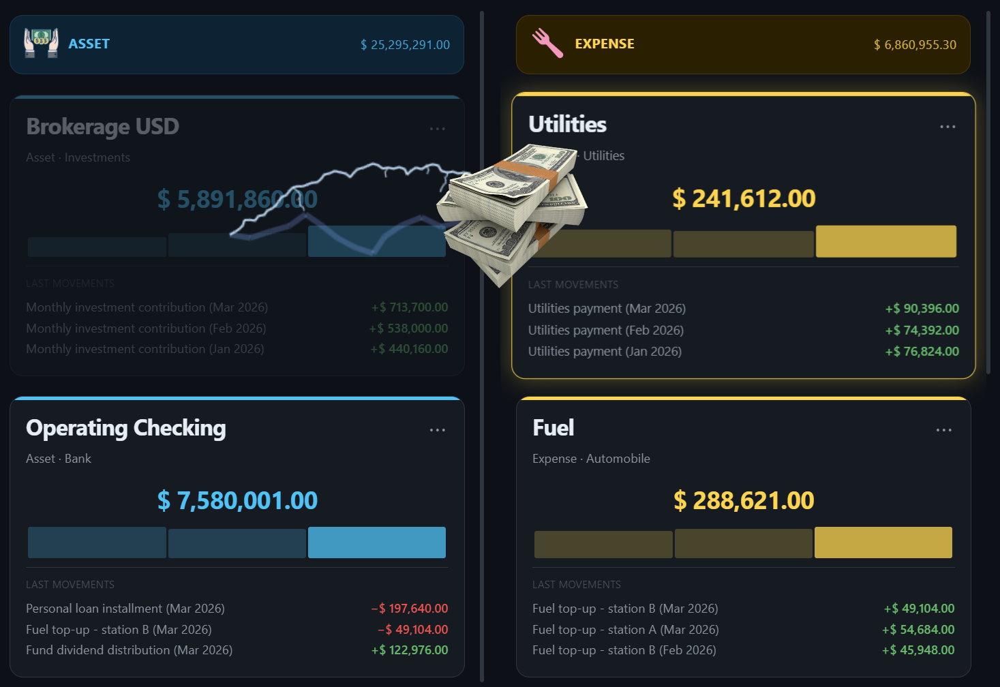
</p>
<p align="center"><em>Las interacciones de arrastre resaltan visualmente la cuenta origen y la de destino durante una transferencia, con efectos FX opcionales como refuerzo visual.</em></p>

### Reportes y auditoría

Open Accountant incluye cuatro vistas orientadas a reportes: Balance General, Libro Diario, Libro Mayor y Transacciones.

- Diario, Mayor y Transacciones soportan orden ascendente o descendente por fecha
- El Balance puede ocultar líneas de cuentas, dejar solo los subtotales y mostrar u ocultar grupos con saldo cero
- El Balance también puede filtrar la información visible por tipo contable
- Al hacer clic sobre cuentas del balance puedes abrir el mayor relacionado
- Los modales de detalle de transacción muestran monto contabilizado, monto original, moneda, tasa FX, fuente FX, fecha y descripción
- Las exportaciones CSV y PDF preservan el contexto activo del reporte e incluyen campos FX cuando corresponde

<p align="center">
  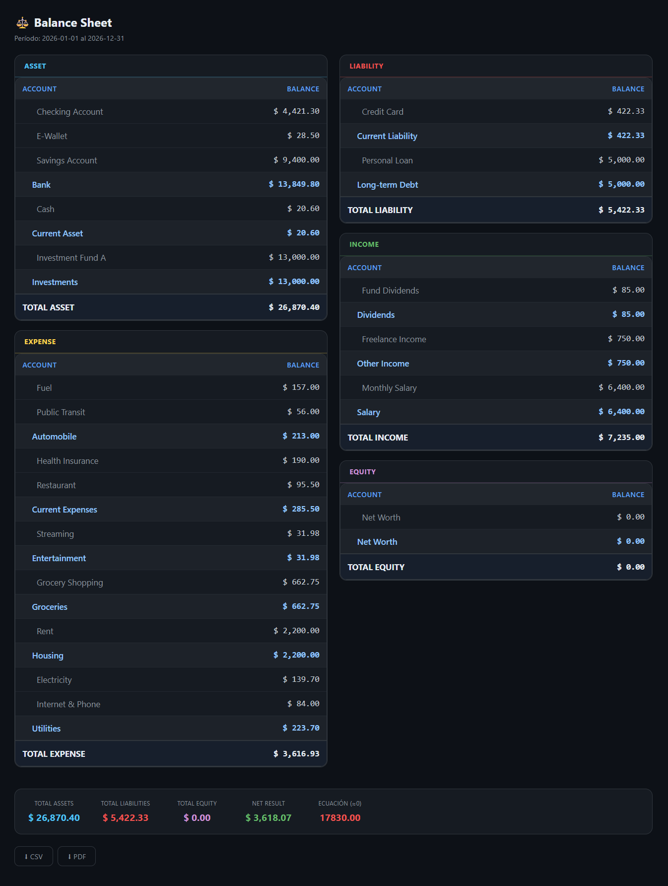
</p>
<p align="center"><em>El Balance General agrupa cuentas por clase contable y subtotales, manteniendo filtros de período y control sobre los saldos en cero.</em></p>

<p align="center">
  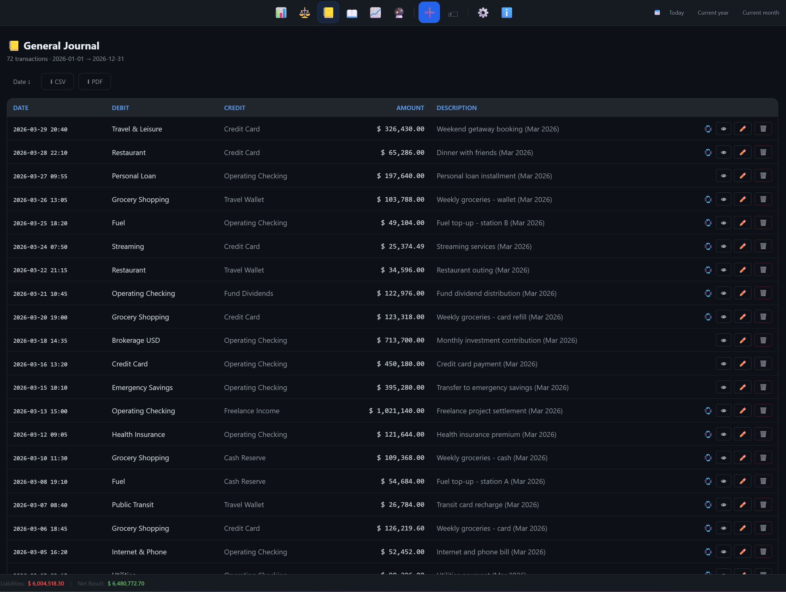
</p>
<p align="center"><em>El Libro Diario muestra los asientos en orden cronológico y deja a mano las acciones de exportar, ver detalle, editar y eliminar.</em></p>

<p align="center">
  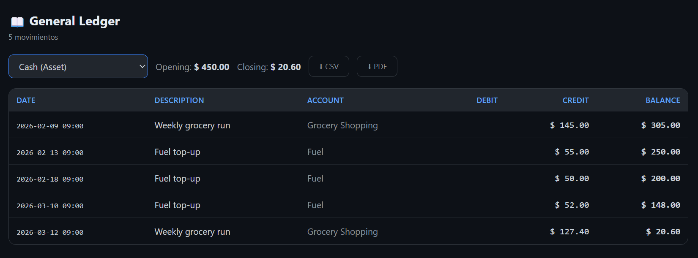
</p>
<p align="center"><em>El Libro Mayor se centra en una cuenta a la vez, mostrando contrapartidas, saldo acumulado y accesos de exportación.</em></p>

### Dashboard estadístico

La vista de estadísticas va más allá de los gráficos básicos y resume la salud financiera general.

- Tarjetas KPI para ingresos totales, gastos totales, resultado neto, neto mensual promedio y tasa de ahorro
- Indicadores de volatilidad y cantidad de meses negativos para evaluar calidad del flujo
- Patrimonio neto, ratio de deuda, ratio corriente, prueba ácida y runway de liquidez
- Activos corrientes, activos rápidos, pasivos corrientes y base de gasto esencial para interpretar liquidez
- Gráfico de flujo mensual con contexto de tendencia móvil
- Desgloses de ingresos y gastos por subtipo
- Composición de activos y concentración por cuentas principales
- Evolución patrimonial a lo largo del periodo seleccionado

<p align="center">
  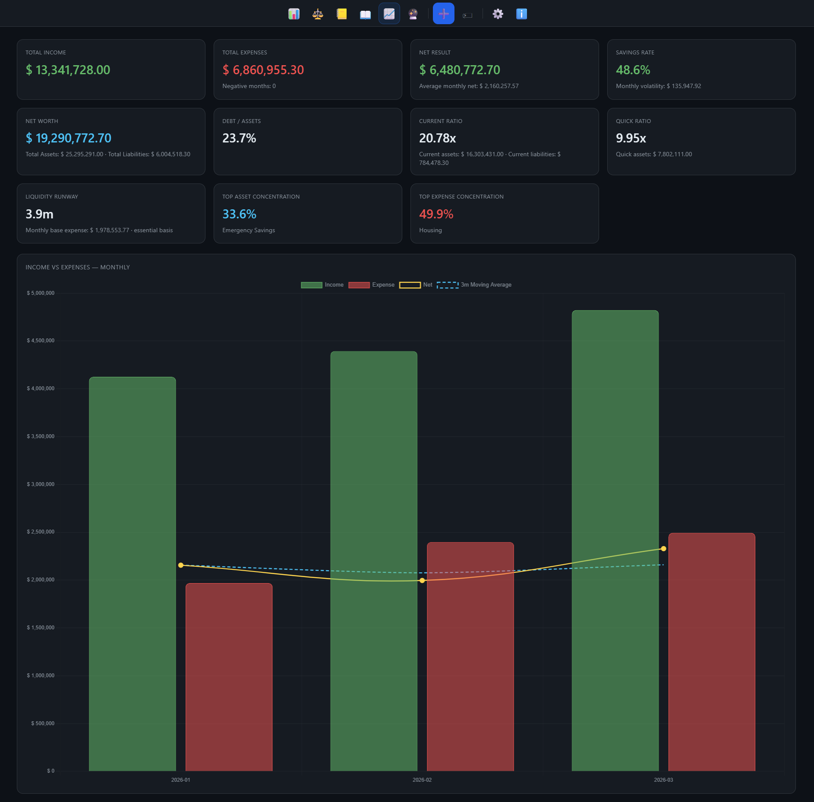
</p>
<p align="center"><em>La cabecera estadística resume ingresos, gastos, ahorro, liquidez y concentración antes de profundizar en la tendencia mensual.</em></p>

<p align="center">
  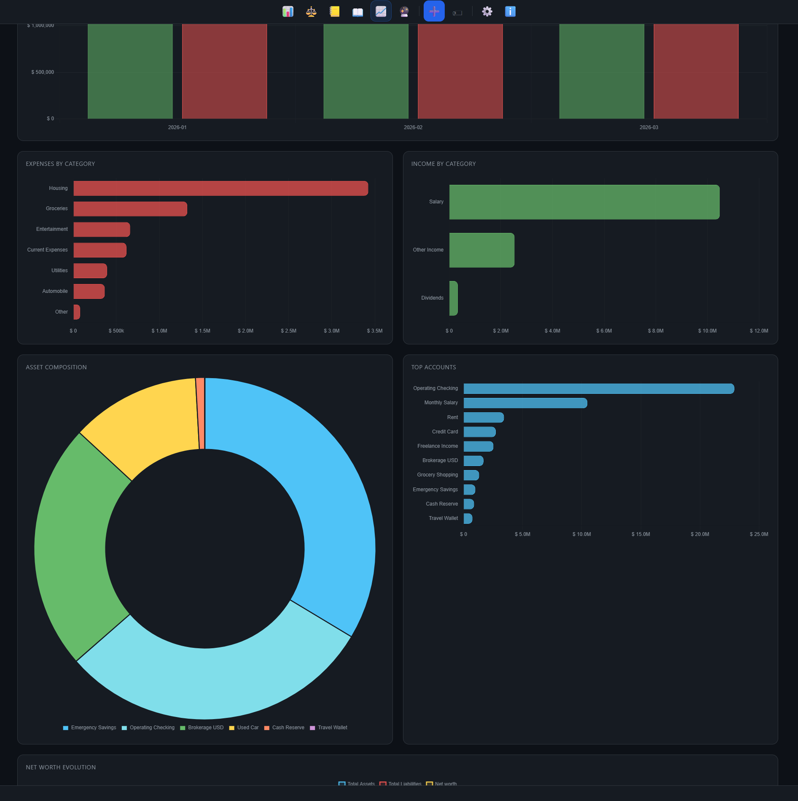
</p>
<p align="center"><em>Los desgloses por categoría, la composición de activos y la concentración por cuentas facilitan detectar dependencias estructurales del libro.</em></p>

### Proyecciones financieras

Abre la vista Projections para estimar estados futuros a partir del comportamiento histórico y de series planificadas.

- Elige un horizonte de 1 a 10 años
- Elige una ventana histórica de 3 a 24 meses
- Ejecuta proyecciones por regresión para ingresos, gastos, ahorro, activos y pasivos
- Rellena meses históricos dispersos usando regresión para que los faltantes no deformen la tendencia
- Agrega series futuras programadas para cuotas, bonos o gastos previstos
- Edita o elimina esas series desde la misma pantalla
- Compara proyecciones base contra escenarios que incluyen series programadas
- Revisa tarjetas de salud para el estado actual, el final del caso base, el final con escenario y el delta del escenario
- Observa cambios proyectados en patrimonio neto, ratio corriente, prueba ácida y runway de liquidez

### Configuración, preferencias y automatización

Settings se divide en pestañas de Books, Configuration y Env.

- Configura host, puerto, nombre de la app e idioma en tiempo real
- Gestiona las cotizaciones financieras manualmente desde la UI
- Trae la última cotización oficial y blue desde Bluelytics y deriva automáticamente la cotización tarjeta
- Guarda la configuración financiera global en `data/app_meta.sqlite3`
- Migra automáticamente preferencias financieras legacy hacia la configuración global al iniciar
- Guarda por libro preferencias como ocultar cuentas o mostrar saldos cero
- Persiste direcciones de orden en reportes y otras preferencias visuales
- Edita el archivo raíz `.env` desde la UI
- Enmascara variables sensibles y conserva secretos ocultos salvo que se modifiquen explícitamente
- Habilita efectos de sonido FX opcionales para arrastre y transiciones

<p align="center">
  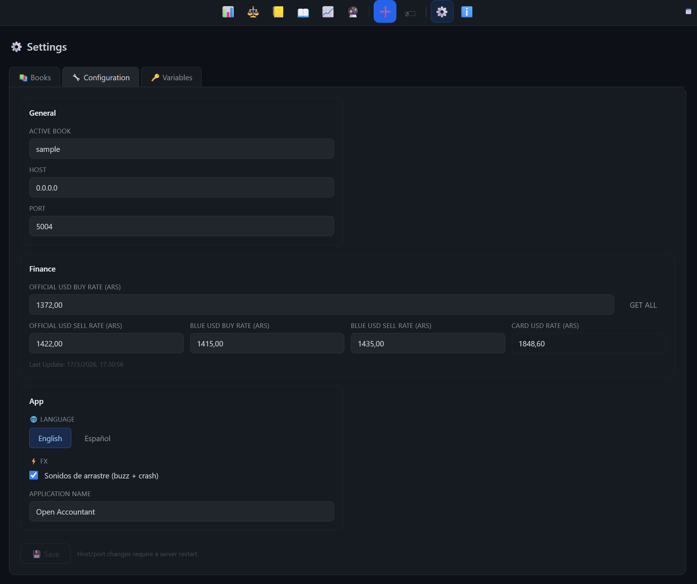
</p>
<p align="center"><em>La configuración centraliza libro activo, dirección de enlace, cotizaciones, idioma y efectos FX opcionales en un solo panel.</em></p>

### Backup y restauración

- Exporta cualquier libro como volcado SQL desde Settings -> Books
- Importa un volcado SQL existente en un libro nuevo
- Mantiene tus datos portables sin depender de cuentas de usuario o servicios del proveedor

### About e integridad

La vista About expone metadatos del proyecto, versión, enlace al código fuente e información del autor. Esos metadatos se verifican con un control de integridad basado en HMAC, y la interfaz muestra una advertencia si falla esa verificación.

---

## Acceso por LAN / remoto

Configura la dirección de enlace a un host visible en la red, como 0.0.0.0, si quieres acceder desde otro dispositivo en tu LAN. Con el servidor en marcha, abre desde otro dispositivo:

`http://<tu-ip-local>:5001/`

Para acceso remoto seguro, Tailscale funciona muy bien porque la app no es más que un servicio HTTP ejecutándose en tu propia máquina.

---

## Integración con OpenClaw

Open Accountant puede iniciarse y gestionarse desde el framework de agentes OpenClaw.

### Inicio vía OpenClaw

Agrega esto a HEARTBEAT.md de OpenClaw o invócalo por chat:

```text
Start Open Accountant at ~/apps/accountant/start.sh
```

### Tile del launcher

Si usas el plugin OpenClaw Memory Dashboard, agrega Open Accountant a launcher.html:

```html
<a href="http://localhost:5001/" target="_blank" class="card">
  <span class="icon">💰</span>
  <span class="label">Open Accountant</span>
</a>
```

### Skill del agente

También puedes construir una skill de OpenClaw para consultar saldos, registrar transacciones o producir reportes con lenguaje natural.

---

## Referencia de configuración

La configuración global de la aplicación se almacena en `data/app_meta.sqlite3`.

| Key | Default | Descripción |
| --- | --- | --- |
| `[general] current_book` | `home` | Nombre del libro activo mapeado a `data/<name>.db` |
| `[general] host` | `0.0.0.0` | Dirección de enlace del servidor |
| `[general] port` | `5001` | Puerto HTTP |
| `[app] name` | `Open Accountant` | Nombre visible de la aplicación |
| `[app] language` | `en` | Idioma de la interfaz por defecto |
| `[finance] usd_official_buy_ars` | `0.00` | Cotización oficial compra usada al registrar transacciones en USD |
| `[finance] usd_official_sell_ars` | `0.00` | Cotización oficial venta |
| `[finance] usd_blue_buy_ars` | `0.00` | Cotización blue compra |
| `[finance] usd_blue_sell_ars` | `0.00` | Cotización blue venta |
| `[finance] usd_card_ars` | `0.00` | Cotización tarjeta, derivada de oficial venta x 1.30 |
| `[finance] usd_official_last_update` | `` | Marca temporal de la última actualización financiera manual o automática |

Los archivos legacy `config.ini` se tratan solo como fuentes de migración. Las instalaciones nuevas usan configuración respaldada por SQLite.

Las variables de entorno opcionales se leen desde el archivo raíz `.env`, que puede editarse desde Settings -> Env. Las claves sensibles se muestran enmascaradas en la UI.

---

## Internacionalización

La interfaz soporta inglés y español de forma nativa.

- Cambia el idioma en tiempo real desde Settings -> Configuration
- Las traducciones JSON viven en `static/locales/`
- Los catálogos Gettext viven en `locales/{en,es}/LC_MESSAGES/messages.po`

### Agregar un nuevo idioma

```bash
cp static/locales/en.json static/locales/fr.json
python3 i18n_tools.py extract
python3 i18n_tools.py compile
python3 i18n_tools.py stats
```

---

## Datos y privacidad

- Toda la información de negocio se guarda localmente en archivos SQLite dentro de `data/`
- Por defecto no se envía nada a servicios cloud externos
- Los archivos `data/*.db` están ignorados por git
- `data/app_meta.sqlite3` guarda la configuración global
- Cada libro guarda sus propias transacciones, cuentas, series de proyección y preferencias de usuario

---

## Contribuir

Las contribuciones son bienvenidas.

- Lee `CONTRIBUTING.md` para el flujo de trabajo
- Sigue `CODE_OF_CONDUCT.md` en todos los espacios del proyecto
- Usa `SECURITY.md` para reportar vulnerabilidades en privado
- Revisa `CHANGELOG.md` para notas de versión

Las contribuciones asistidas por IA son bienvenidas, pero siguen requiriendo revisión cuidadosa.

### Reporte de issues

Incluye por favor:

- OS y versión de Python
- Pasos para reproducir
- Comportamiento esperado y comportamiento real

---

## Releases y versionado

Open Accountant busca seguir Semantic Versioning.

- Las notas de versión viven en `CHANGELOG.md`
- Los tags git deben usar el formato `vX.Y.Z`
- GitHub Actions puede construir artefactos de test e imágenes Docker
- Los releases etiquetados pueden publicar assets empaquetados automáticamente
- Docker es el formato principal para despliegues reproducibles

---

## Estructura del proyecto

```text
open-accountant/
├── main.py
├── database.py
├── app_config.py
├── models.py
├── i18n_tools.py
├── requirements.txt
├── requirements-dev.txt
├── config.ini.example
├── docs/
│   └── images/
├── install.sh
├── install.bat
├── start.sh
├── routers/
│   ├── accounts.py
│   ├── books.py
│   ├── projections.py
│   ├── reports.py
│   ├── settings.py
│   ├── subtypes.py
│   ├── transactions.py
│   ├── types.py
│   └── about.py
├── services/
│   ├── accounts_service.py
│   ├── projections_service.py
│   ├── reports_service.py
│   ├── settings_service.py
│   ├── transactions_service.py
│   ├── helpers.py
│   └── about_service.py
├── scripts/
│   └── seed_demo.py
├── static/
│   ├── index.html
│   ├── css/
│   ├── images/
│   ├── locales/
│   │   ├── en.json
│   │   └── es.json
│   └── js/
│       ├── about.js
│       ├── app.js
│       ├── board.js
│       ├── charts.js
│       ├── forms.js
│       ├── fx.js
│       ├── i18n.js
│       ├── projections.js
│       ├── reports.js
│       └── settings.js
├── locales/
│   ├── en/LC_MESSAGES/
│   └── es/LC_MESSAGES/
├── tests/
│   ├── test_api_smoke.py
│   └── test_services_unit.py
└── data/
    └── .gitkeep
```

---

## Licencia

Licencia MIT. Ve `LICENSE` para más detalles.

## Sobre el autor

<p align="left">
  
</p>

Marcelo Valdez es Ingeniero Electrónico y Desarrollador de Software, enfocado en adquisición de datos, instrumentación, análisis de señales, APIs y aplicaciones impulsadas por IA. Construye software práctico que conecta necesidades reales de ingeniería con herramientas modernas de desarrollo, con fuerte énfasis en Python, automatización y resolución técnica de problemas. Vive en Córdoba, Argentina.

- GitHub: https://github.com/marzzelo
- LinkedIn: https://www.linkedin.com/in/marcelovaldez/
- Email: zedlavolecram@gmail.com

```
systemctl --user status accountant.service   # ver estado
systemctl --user stop accountant.service     # detener
systemctl --user restart accountant.service  # reiniciar
```


[Read this in English](README.md)

